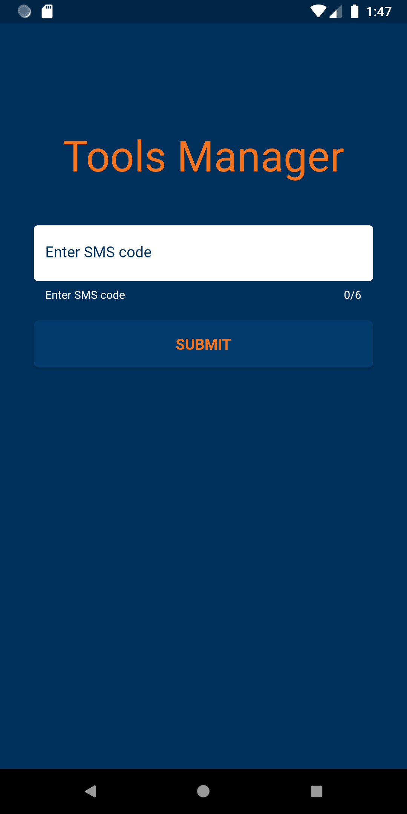

# tools_manager

A mobile application designed to manage tools in an engineering company.
It improves the flow of tools between employees.  
The application gives an overview what tools are available across the company and who has responsibility for them.

## Table of contents

- [Features](#features)
- [Screenshots](#screenshots)
- [Technologies](#technologies)
- [Setup](#setup)
- [Launch](#launch)
- [Test](#test)

## Features

- Phone authentication
- Role based authorization
- User management
  - create
  - update
  - delete
- Tools management
  - create
  - update
  - delete
  - transfer
  - return
  - confirm / cancel
- Search

## Screenshots

[](_screenshots/phone_auth.png)
[](_screenshots/sms_code.png)
[](_screenshots/home_screen.png)
[](_screenshots/toolbox_screen.png)
[](_screenshots/tool_details_screen.png)
[](_screenshots/tool_details_screen2.png)
[](_screenshots/transfer_tool.png)
[](_screenshots/add_tool.png)
[](_screenshots/toolbox_menu.png)
[](_screenshots/edit_tool.png)
[](_screenshots/delete_tool.png)
[](_screenshots/available.png)
[](_screenshots/users_screen.png)
[](_screenshots/user_details_screen.png)
[](_screenshots/add_user.png)
[](_screenshots/search_result.png)

## Technologies

- Dart
- Flutter
- Firebase

## Setup

- Clone or download this repository.
- Use the following command to install all the dependencies:

```
  flutter pub get
```

- Use the following command to update to the latest compatible versions of all the dependencies:

```
  flutter pub upgrade
```

- Use the following command to create platform-specific folders:

```
  flutter create .
```

- Create Firebase project
- Enable Phone Number sign-in
- Enable app verification
- Use [FlutterFire CLI](https://firebase.flutter.dev/docs/cli/) which connect Flutter application with Firebase, to generate configuration file `firebase_options.dart`
- Delete folder `.dart_tool/flutter_gen`
- Use the following command to generate files for internationalization:

```
  flutter gen-l10n
```

## Launch

To start using the application create collection named `users` in Cloud Firestore.
In this collection create a document with the following data:

```
mobileNumber: "+48666777888"
name: "Username"
role: "master"
```

Use the appropriate values for `mobileNumber` and `name`.
Position `role: "master"` should remain unchanged.

Run the application using your IDE or using the following command:

```
flutter run
```

## Test

Run the tests using your IDE or using the following command:

```
flutter test
```
